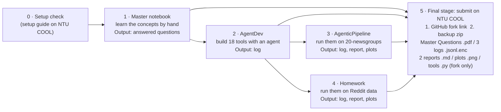

# DM2026 Lab 1

Your map of the whole lab: what to do, in what order, where everything lives, what to submit, and how each part is graded.

Lab 1 has two halves. First you learn a text mining pipeline by hand in the **Master notebook**. Then, in the **agentic exercise**, you direct AI agents to build that same pipeline as your own tools and run it on two datasets.

**Before you start, read the setup announcement: [DM2026-Lab1-Announcement](https://github.com/difersalest/DM2026-Lab1-Announcement).** It walks you through installing the environment, creating your API keys, and testing that everything works.

## At a glance

| | |
| --- | --- |
| Materials open on NTU COOL | Sep 28, 9:00 am |
| Deadline | **Oct 19, 11:59 pm** (one submission) |
| Total | 100 points |
| Environment | Local only: Python 3.11 with `uv`. We recommend JupyterLab (`uv run jupyter lab`); VS Code works too, but its chat box display can be unreliable. |

## The order to work in



0. **Setup:** follow the [setup announcement](https://github.com/difersalest/DM2026-Lab1-Announcement).
1. **Master notebook:** answer the Master Questions.
2. **AgentDev:** build and test your 18 tools.
3. **AgenticPipeline** (needs step 2)**:** run your tools from step 2 on 20-newsgroups, write report 1.
4. **Homework** (needs step 2)**:** run your tools from step 2 on Reddit data, write report 2.
5. **Submit:** push, then hand in your fork link and zip ([details](#what-to-submit)).

## The notebooks

| Notebook | What you do | What you learn |
| --- | --- | --- |
| `DM2026-Lab1-Master.ipynb` | Run the full pipeline step by step on 20-newsgroups: tokenization, document-term matrix, variance and correlation filtering, frequent pattern mining, dimension reduction, similarity. | The data mining concepts the rest of the lab builds on. |
| `DM2026-Lab1-AgentDev.ipynb` | Direct a coding agent to build 18 pipeline tools: point it at the spec, discuss its plan, review and approve each file, then have it write and run tests against known answers. | Spec-driven development, reviewing AI-written code, and testing. |
| `DM2026-Lab1-AgenticPipeline.ipynb` | Approve an analysis agent's access to your tools, direct it step by step through the pipeline on 20-newsgroups, then write a report. | Orchestrating an agent, questioning its results, and interpreting an analysis. |
| `DM2026-Lab1-Homework.ipynb` | The same tools and agent on a new Reddit stock-sentiment dataset, with a second report. | Whether your tools generalize, and how results change with different data. |

## Where everything is

| File or folder | What it is |
| --- | --- |
| `DM2026-Lab1-Master-Questions.docx` | The questions to answer, exported to PDF for submission. |
| `DM2026 Lab 1 Master Notebook slides.pdf` | Slides for the Master notebook tutorial video. |
| `DM2026 Lab 1 The Agentic Exercise slides.pdf` | Slides for the agentic exercise tutorial video. |
| `agent_dev/` | The coding agent, plus the files you (and the agent) work from: `TOOLS_PIPELINE_BREAKDOWN.md` (the contract for each tool), `TEST_FIXTURE.md` (known answers to test against), `BACKEND_SCHEMA_NOTES.md` (parameter types to avoid), and `GLOSSARY.md` (every technical term explained). |
| `agent_pipeline/` | The agent harness that runs the chats. You don't need to edit anything here. |
| `premade_tools/` | The two tools you are given: `load_dataset_tool` and `visualize_result_tool`. Read them as examples of a finished tool. |
| `helpers/` | Helper functions the notebooks use. |
| `newdataset/` | The Homework dataset (`Reddit-stock-sentiment.csv`). |
| `output_files/` | Figures and intermediate files the Master notebook saves. |
| `config/.env.example` | Template for your API keys. Copy it to `config/.env`; never commit `.env`. |

These folders are **created as you work** and don't exist when you first fork the repo:

| Folder | Created by | What goes in it |
| --- | --- | --- |
| `agent_dev_workspace/` | AgentDev, when the agent writes a file | The tools and tests you build. |
| `session_logs/` | Every agentic notebook, as soon as you start chatting | Your encrypted conversation logs. |
| `plots/` | AgenticPipeline and Homework, when a tool makes a plot | Saved plots, named after the result that produced them. |
| `reports/` | The "Create your report file" cell | Your two report files. |

## What to submit

One submission on NTU COOL before **Oct 19, 11:59 pm**, with two pieces:

1. **The link to your GitHub fork**, with all your work pushed.
2. **A backup zip** named `{your NTU COOL name}_{student ID}_files.zip`, containing:

| File | From |
| --- | --- |
| `{name}_{ID}_solved_master_questions.pdf` | The Master Questions, answered and exported to PDF |
| `session_logs/agent_dev_session.jsonl.enc` | AgentDev |
| `session_logs/agent_pipeline_session.jsonl.enc` | AgenticPipeline |
| `session_logs/homework_session.jsonl.enc` | Homework |
| `reports/{name}_{ID}_agentic-pipeline_report.md` | AgenticPipeline |
| `reports/{name}_{ID}_homework_report.md` | Homework |
| `plots/` | AgenticPipeline and Homework |

**Watch the file types, they are not all the same:**

- **Master Questions: PDF.** Answer in the `.docx`, then export it to `.pdf`.
- **Reports: Markdown (`.md`).** The notebook's "Create your report file" cell creates the `.md` for you in the `reports/` folder, already named correctly. Write your report in that file and submit it as `.md`, not PDF or Word.
- **Logs (`.jsonl.enc`) and plots (`.png`): nothing to worry about.** The notebooks create them for you in the right format. Just don't rename or edit them.

Don't rename or edit the log files. Each agentic notebook's last cell checks that your log file exists and shows its size, so run it before submitting. Pushes after the deadline lose points.

**Before your final push:** open `.gitignore` and make sure `session_logs/`, `plots/`, `reports/` and `agent_dev_workspace/` are not in it. If any line mentions one of those folders, delete that line and save. Otherwise git skips those folders and they never reach GitHub. Then push:

```
git add .
git commit -m "Lab 1 submission"
git push
```

A folder missing on GitHub means it wasn't submitted, even if it's on your laptop.

## How it's graded

| Section | Points | Graded from |
| --- | --- | --- |
| Master Questions | 40 | Your answered questions (PDF) |
| AgentDev | 15 | Your conversation log |
| AgenticPipeline | 20 | Conversation log (15) + report (5) |
| Homework | 25 | Conversation log (15) + report (10) |
| **Total** | **100** | |

Your conversation logs are encrypted and record your whole chat with the agent: your prompts, the tools it called, and its replies. They are decrypted after the deadline and graded on **how you directed the agent**, not on the agent's own writing. Your tool code has no separate points: a tool that breaks but that you debug thoughtfully with the agent can still earn full conversation credit. Logs and reports are graded against fixed rubrics.

The agent won't stop you from bad habits in the moment: it doesn't refuse vague or copied prompts, or requests to skip steps. None of that blocks you during the chat, but all of it counts afterward, when your log is graded.

### Master Questions (40 points)

Your answers to the 10 questions in `DM2026-Lab1-Master-Questions.docx`, submitted as one PDF. Each question points to a `Question N (take home)` spot in the Master notebook.

**Scoring:** each question is worth 4 points, split evenly across its sub-questions. For example, a question with 2 parts gives 2 points per part; one with 3 parts gives about 1.33 points per part.

Answer every part of each question, changing parameters in the notebook when the question asks (thresholds, `k`, `minSup`, and so on).

#### Sources, honesty, and AI use

**Acceptable vs. Unacceptable AI Usage:** Generative AI should serve as an interactive tutor to guide your understanding, not as an automated solver completing the assignment for you.

> [!TIP]
> **Permitted (AI as Guide & Editor):**
> - Asking AI to explain unfamiliar theoretical concepts, discuss algorithmic trade-offs, or troubleshoot runtime errors in the notebook.
> - Polishing the grammar, phrasing, and readability of your own original, self-written drafts.

> [!CAUTION]
> **Prohibited (AI as Solver):**
> - Copying assignment questions directly into an AI tool to generate answers.
> - Using AI to fabricate experimental results or observations without executing the code in `DM2026-Lab1-Master.ipynb`.
> - Submitting machine-generated prose wholesale.

**Under each question, complete:**

- **AI used for this answer:** Yes / No. Write "No" (or leave it blank) only if you truly didn't use AI.
- **If yes, how:** e.g. brainstorming, grammar, concept explanation.
- **External references (links):** required when AI = Yes, with at least one link that validates your answer (official docs, textbook, paper or reputable tutorial; the AI chat alone doesn't count). Encouraged otherwise. Cite any source beyond the notebook with **clickable links** (or DOI/ISBN when no URL exists).

Write in English. Keep answers concise and specific.

### AgentDev log (15 points)

What earns credit:

- **Specific, directed requests.** Ask for one concrete thing at a time instead of leaving the scope to the agent.
- **Reviewing proposals.** Read and respond to the agent's proposed code before you approve it.
- **Your own prompts.** Don't copy-paste the notebook's example prompts. A copied example counts as a vague request, because the direction came from the notebook, not you. Use them to see the idea, then write your own.
- **Doing the work yourself.** Don't ask the agent to skip its explanations. And don't ask it to build `load_dataset_tool` or `visualize_result_tool`: those two already come ready-made in `premade_tools/`, so your 18 tools are the other ones in `TOOLS_PIPELINE_BREAKDOWN.md`.
- **Progression.** Later turns build on earlier ones instead of reading as disconnected one-off asks.
- **For each tool you build:**
    - point the agent at the spec (`TOOLS_PIPELINE_BREAKDOWN.md` for the tool, `TEST_FIXTURE.md` for its test) instead of describing it from memory. `inspect_data_tool` and `binarize_labels_tool` have no spec on purpose: for those two, explain how the tool should work in your own words before the agent writes code;
    - discuss the design: ask why, push back when something looks off;
    - test it: have a test written and actually run, and engage with the result.

### AgenticPipeline log (15 points) and Homework log (15 points)

Both use the same criteria:

- **Your own prompts.** Don't copy-paste the notebook's example prompts; write your own requests for your analysis.
- **Specific, directed requests.** One concrete analysis step at a time, with a specific tool and arguments.
- **Conceptual engagement.** Ask why a result looks the way it does; question numbers and choices (a threshold, a method, why a term survived a filter).
- **Engaging with the actual results.** Follow up on what the tools really returned: ask to see rows, catch something odd.
- **Approving tool access deliberately.** Treat the one-time access approval as a real decision, not a reflex.
- **Progression.** Follow the pipeline order and build on earlier results.
- **Analytical follow-through.** Connect results across turns into an actual analysis, instead of a list of unrelated tool calls.

### AgenticPipeline report (5 points) and Homework report (10 points)

Each report is its own file in `reports/`, created by the notebook's "Create your report file" cell. Write it in that file, not in the notebook. Both reports are graded on:

- **Coverage.** Reflects the main steps you actually ran.
- **Correctness.** Every number, term or trend you state matches what your tools actually returned in your log. A well-written report that doesn't match your log can't score well.
- **Specific references.** Cite exact `result_id`s and your saved plots (link images as `../plots/<file>.png`).
- **Stands alone.** Clear to someone who never saw your conversation.
- **Interpretation.** Explain what the results mean, not just restate the numbers.

## Tips

- **Watch the Lab 1 recordings.** We advise watching the tutorial videos for more tips and guidelines on working with the agents. The videos are on the course YouTube channel (linked on NTU COOL), and the slides are in this repo: `DM2026 Lab 1 Master Notebook slides.pdf` and `DM2026 Lab 1 The Agentic Exercise slides.pdf`.
- **Free tier: set up 1 Groq key and 9 Gemini keys.** We strongly suggest it. In `config/.env`, put `GROQ_API_KEY` and `GOOGLE_API_KEY_1` to `GOOGLE_API_KEY_9` (each Gemini key from a separate Google Cloud project), and turn on multi-provider fallback in the setup cell. The agent then switches keys automatically when one hits its limit.
- **Book enough time.** Free-tier rate limits reset only once a day, so you may need several days to test and use the agents. Don't leave it for the last day.
- **Run AgenticPipeline and Homework in one sitting.** In AgentDev you can stop and continue another day: each tool is built on its own, so nothing is lost. In AgenticPipeline and Homework, the agent's memory lives in the running kernel. If you restart the kernel or come back another day, the agent forgets everything it already ran and the pipeline starts over. Before you start either one, make sure you have enough keys and rate limit left to finish the whole run.
- **Have a paid API key?** You can use a paid Groq or Gemini key instead of the multi-provider setup: put it in `config/.env` (`GROQ_API_KEY` or `GOOGLE_API_KEY`) and pick that backend in the setup cell.
- **Use the same name and student ID in every notebook.** Your logs, plots and reports are all identified by them.
- **One tool per message.** The agent runs at most one tool each time you send a message. If you ask for two things, it does the first and tells you what it wants to do next; reply "go ahead".
- **Chat says to wait and send another message? Don't restart the kernel.** It means every key you configured just failed in a row. Wait a few minutes and send another message: the retries continue where they left off. Restarting the kernel throws that progress away and starts the count over.
- **Hitting rate limits? Type `/status` in the chat.** It lists which of your keys are still active and which have hit their limit this session. The chat box answers it by itself, so it doesn't use a request or show up in your graded log.
- **Chat box doesn't show up, or stops updating?**
    - **Before you start chatting:** clear the cell outputs, restart the kernel and run the notebook from the top. If it still doesn't show, re-run `uv sync` (it must finish without errors), or open the notebook in JupyterLab instead, where the chat box is most reliable.
    - **In the middle of an AgenticPipeline or Homework run:** don't restart the kernel or re-run the chat cell, since both erase the agent's memory of your run. In VS Code, try `Developer: Reload Window` from the Command Palette first, and check whether your chat is still there before doing anything else.
    - **In AgentDev,** restarting is always safe: your tools are saved as files.
- **Changed a `.py` file, or something looks stale?** Restart the kernel and run the notebook from the top.
- **You don't need all 18 tools before trying AgenticPipeline.** Start once you've built at least one: unfinished tool files are skipped, and you can come back as you build more.
- **Seeing "Processing your request..."?** The agent is retrying through a busy provider or a rate limit and switching keys for you. Type `/status` to see which of your keys are still active.
- **Built a new tool mid-session?** Re-run the pipeline notebook's "Discover your tools" cell and the chat cell to pick it up.

## Learn more

- `agent_dev/GLOSSARY.md` explains every technical term used in the lab (39 of them), and the AgentDev notebook explains the main ideas as you meet them.
### LangGraph: the framework the lab's agent is built on

- [LangGraph overview](https://docs.langchain.com/oss/python/langgraph/overview) (official docs)
- [LangGraph Essentials](https://academy.langchain.com/courses/langgraph-essentials-python) (free LangChain Academy course)

### How AI agents and harnesses work

- [Building Effective AI Agents](https://www.anthropic.com/research/building-effective-agents) (Anthropic)
- [Effective Harnesses for Long-Running Agents](https://www.anthropic.com/engineering/effective-harnesses-for-long-running-agents) (Anthropic)

thx!